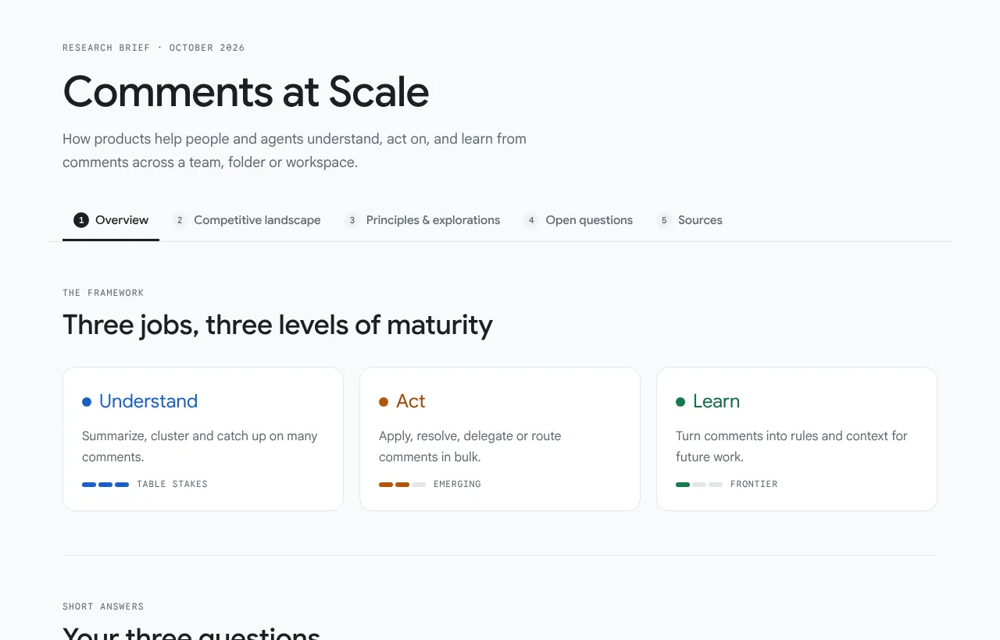
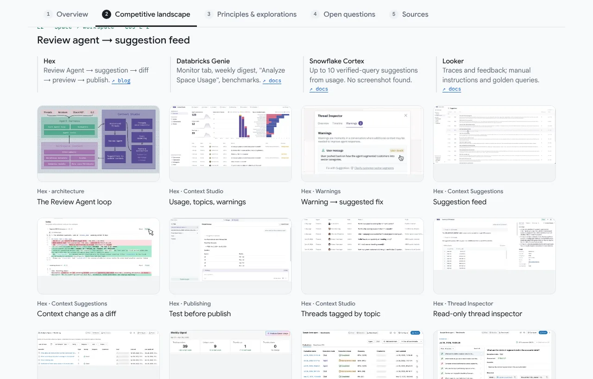

# ux-competitive-research

An agent skill that turns a UX question ("how are other products solving X?")
into a sourced competitive research report: one HTML page with **real product
screenshots**, **charts**, **CUJs**, **design principles**, **sketches** and
**open questions**.

Built for designers who want to *see* the competition, not read about it.




## What you get

A five-chapter page with numbered tabs:

| Chapter | Contents |
|---|---|
| 1 · Overview | Your framework (e.g. Understand / Act / Learn), short answers, evidence chart, product × pillar capability grid |
| 2 · Competitive landscape | **Facts only.** Scope heatmap, then per pillar: CUJs, patterns, one-line product facts, clickable screenshots |
| 3 · Principles & explorations | Interpretation: principles per pillar, a loop diagram, one sketch per pattern, opportunities |
| 4 · Open questions | Decisions ahead and what the research couldn't verify |
| 5 · Sources | Every link used |

Light and dark mode, phone-friendly, Google Sans, deep links (`#learn`, `#s-hex-diff`).

## Example

[`examples/comments-at-scale/`](examples/comments-at-scale/) studies how products
handle **comments at team, folder and workspace scale** (Google Docs & Drive,
Confluence, Word, Figma, GitHub Copilot, Cursor Bugbot, CodeRabbit, Linear, Hex,
Databricks Genie, Snowflake, ThoughtSpot, LangSmith, MLflow, and more), with
49 screenshots and a data-analytics lens.

Open `examples/comments-at-scale/index.html` in a browser. With GitHub Pages
enabled on `main`, it's at
`https://ashlithos.github.io/ux-competitive-research/examples/comments-at-scale/`.

## Install

Claude Code (personal skills):

```bash
git clone https://github.com/ashlithos/ux-competitive-research ~/.claude/skills/ux-competitive-research
```

Or with the skills CLI:

```bash
npx skills add ashlithos/ux-competitive-research
```

Then ask: *"Research how products handle X for designers. Organize it by
&lt;your framework&gt; and include screenshots."*

## How it works

1. **Frame**: confirm the question, framework pillars and lens.
2. **Research**: evidence the problem is real, then each product's docs and changelogs.
3. **Map**: each product per pillar (shipped / basic / none), patterns and CUJs.
4. **Screenshots**: `scrape_images.py` → `extract_frames.py` → `contact_sheet.py` review → `to_webp.py`.
5. **Build**: write `spec.json` + `template.html`, run `build_report.py`.

```bash
python3 scripts/build_report.py examples/comments-at-scale
```

Requires Python 3 with Pillow; `ffmpeg` for video frames; Playwright (optional) for render checks.

## Repo layout

```
SKILL.md                     instructions the agent follows
templates/report.html        page template (tokens, tabs, charts, lightbox)
scripts/                     scrape, frames, contact sheet, webp, build
references/                  structure & text budgets, screenshots, charts
examples/comments-at-scale/  spec.json, template.html, index.html, shots/
```

## License

Code and guidance: MIT. Screenshots in the example belong to their respective
companies; see [NOTICE.md](NOTICE.md).
